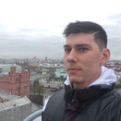

# My urriculum vitae


## Abdulkhalikov Maksim

***

### Contacts:
* Russia, Saratov
* Telegram: [Maksim_1509](https://t.me/Maksim_1509)
* Discord: Max(@Maksim1509)
* Github: https://github.com/Maksim1509
* Email: 23maaa23@gmail.com

***

### _So, What about me?_

For the last few years I have been working as a promoter at INMAKSO-LAKRA and I want to become a professional developer. It's my goal. I have already completed a course on the profession of a frontend developer on Hexlet. Now I continue my studies at RSSchool and I hope that my dedication will lead me to the goal.

***

### Skills and Proficiency:

* HTML, CSS, SCSS
* JavaScript Basic
* React Redux
* VScode

***

### Code example

```
const myLanguages = (results) => Object.entries(results)
    .filter(([ lang, score ]) => score >= 60)
    .sort(([langA, scoreA], [langB, scoreB]) => scoreB - scoreA)
    .map(([lang]) => lang);
```
***

### Experience

* **Educational projects**:
  + [Chat](https://thawing-fortress-04345.herokuapp.com/): Messaging app between users.
    [Source](https://github.com/Maksim1509/frontend-project-lvl4)

    Тechnologies are used in the project:
      - React
      - Redux
      - Websockets 

***

### Education

* University: Saratov State Agrarian University
* Courses: 
  + **[Hexlet](https://ru.hexlet.io/u/maksim_a) - Profession Frontend-developer**
  + [HTML Academy](https://htmlacademy.ru/profile/id1042271)

***

### Languages
  * **Russian** - native speaker
  * **English** - A1(A2 - in process... I have a practice of reading technical documentation in English)
  